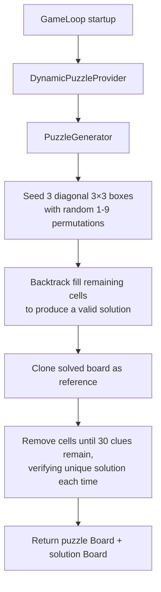

# Sudoku CLI

A command-line Sudoku game written in Java

## Build from source

### Prerequisites

- JDK 21+ - required to build and run

### Steps to build

Clone the repository into your local environment

```bash
git clone https://github.com/CharukaK/sudoku-cli-java.git
```

Run the command `./gradlew clean build` from the repository root

## Running the App

After building the app you can then run the application using 

```bash
java -jar app/build/libs/app.jar
```

You will be prompted with the game as follows


## Design & Assumptions

The app is split into four packages:
- **model** — Board, Cell, Position (game state)
- **game** — SudokuGame, PuzzleGenerator, SudokuValidator (game logic)
- **controller** — CommandParser (input parsing)
- **launcher** — App, GameLoop (entry point and UI loop)

### Design Decisions

- **30 clues per puzzle** — the generator removes cells until 30 remain,
verifying a unique solution each time
- **Hint scans left-to-right, top-to-bottom** — returns the first empty or
wrong cell's correct value
- **Validation is on-demand** — type `check` to find rule violations;
individual moves only check range and pre-filled status
- **Dynamic puzzle generation by default** — the game generates a fresh puzzle
every session using backtracking seeded with diagonal 3×3 blocks

### Assumptions

- The terminal supports ANSI escape codes (Linux and macOS tested; Windows not guaranteed)
- Single-user, single-threaded CLI with no save/load

### Board generation flow


