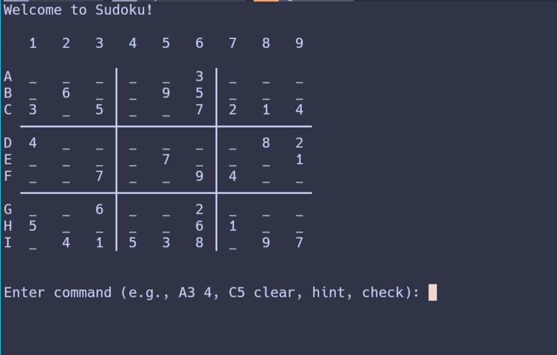

# Sudoku CLI

A command-line Sudoku game written in java

## Build from source

### Prerequisites

- JDK 21+ - required to build and run

### Steps to build

Clone the repository your local environment

```bash
git clone https://github.com/CharukaK/sudoku-cli-java.git
```

Run the command `./gradlew clean build` from the repository root

## Running the App

After building the app you can the run the application using 

```bash
java -jar app/build/libs/app.jar
```

You will be propmpted with the game as follow


> Note: Game is tested only on linux and macos, the ANSI escape codes are not
> properly tested in windows terminal
