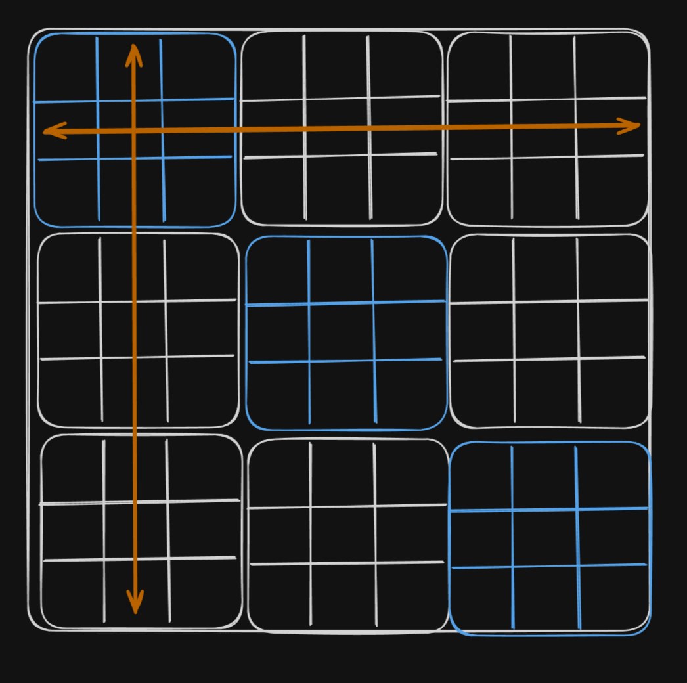

# Sudoku CLI

This is an application that gives a user a sudoku puzzle to solve

## Game Loop

1. Prompts the user with puzzle
2. User can take one of 4 actions
    - `check`: see if there are any issues with the filled cells
    - `hint`: prompt the game for a hint then 
    - set value to the cell by specifying `<column><row> <value>` eg: `A3 3`
    - clear value of a cell using `<column><row> <value>` eg: `A3 clear`
3. Game concludes when the user fills the board with a correct solution

## Entities involved

We could build out the Game UI in the terminal using the following entities
- **Board**: Data holder for the board and gamestate
- **Cell**: Individual cells in the board

Each class will have their own print method that will eventually print out the full board

Other entities
- **Generator**: Puzzle Generator
- **Solver**: Puzzle Solver contains the logic to find solutions to a given board
  arrangement 

## Generation

1. seeding the board: Fill out the 3x3 blocks running diagonally first. 
   > reason:
   diagonal blocks are independant of each other and we can fill them up
   without worrying about the rules. sudoku only checks horizontal and vertical
   
2. Fill out the remaining cells one by one using backtracking we will have to
   validate the row and column every time and course correct 
   conditions for validating:
    - does the number exist in row
    - does the number exist in column
3. After a valid board is generated, we will have to remove a cells from the
   board inorder to create a puzzle, everytime we remove a cell we need to
   solve the board at that state to make sure that there is only one unique
   solution otherwise removal of cell introduces ambiguity

